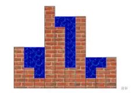

# 这是标题

## 这也是标题

### 这还是标题

*这是倾斜*

**这是加粗。**

~~这是删除。~~

`这是一个代码框`

```cpp
#include<bits/stdc++.h>
using namespace std;
int main(){
    puts("这是一个C++代码框");
    return 0;
}
```

$1+1=2$

$$\sum_{i=1}^{n} i^2$$



[这是一个mp3链接](14%E7%89%88.mp3)

[这是一个文件链接](1.cpp)

[这是一个字体链接](norwester.otf)